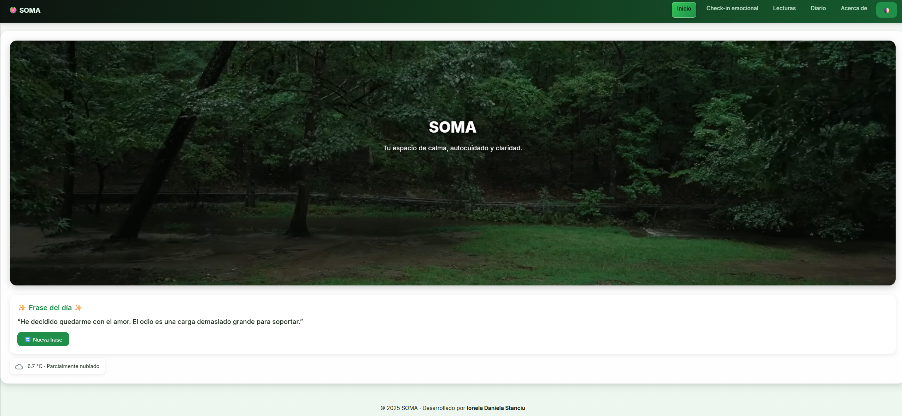
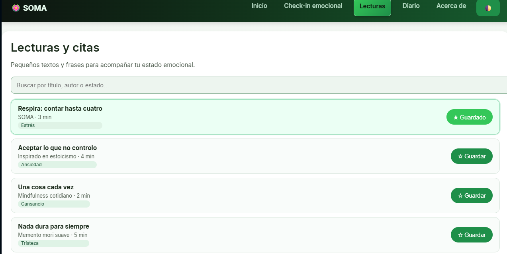
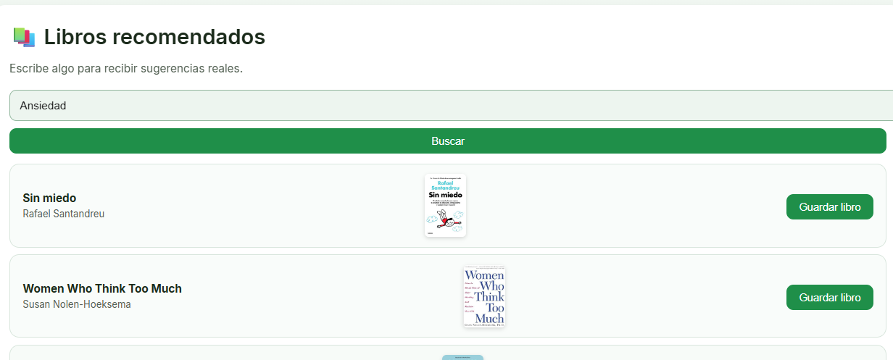
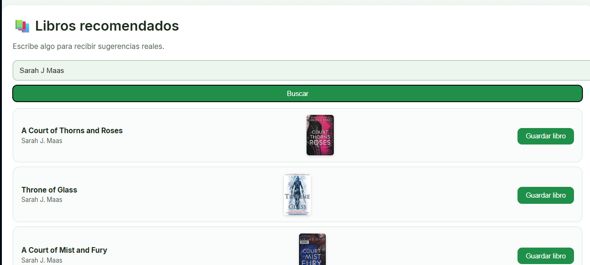
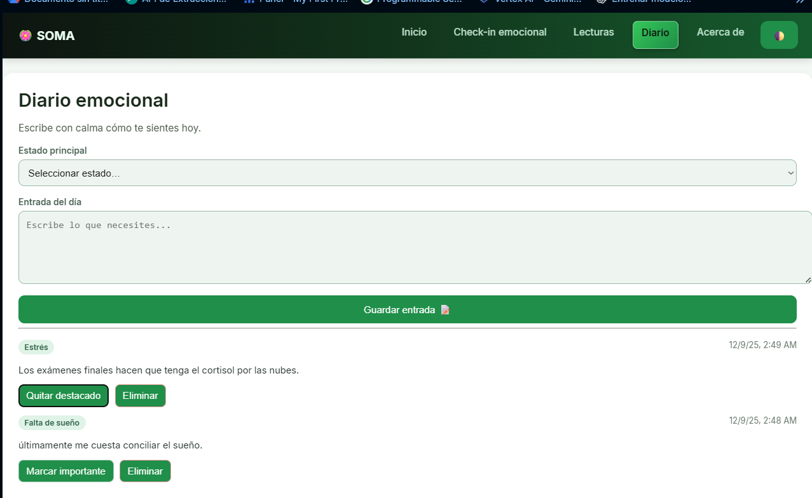
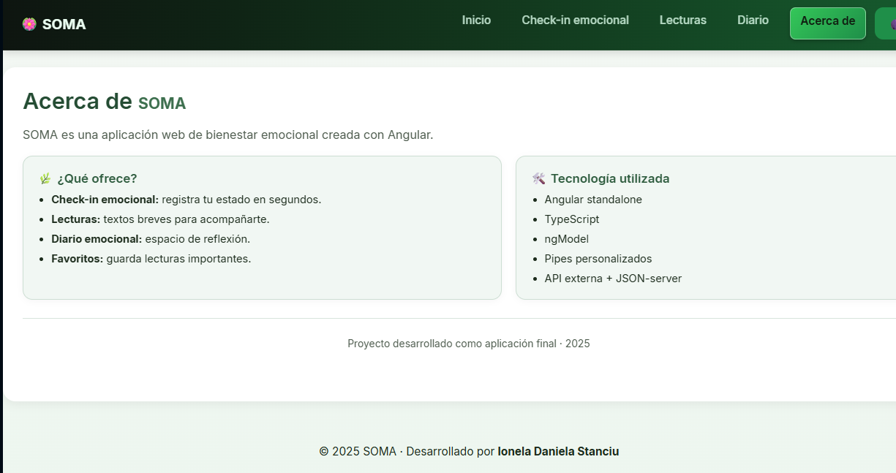
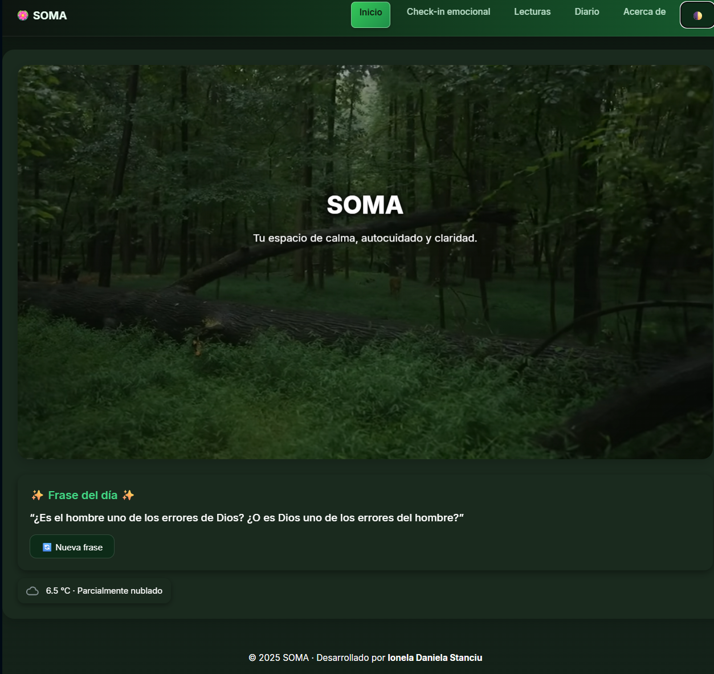

🌿SOMA — Aplicación Web de Bienestar Emocional🌿

Proyecto final del módulo Desarrollo de Interfaces — 2º DAM (2025)
Autora: Ionela Daniela Stanciu

SOMA es una aplicación web orientada al autocuidado emocional.
Permite registrar estados de ánimo, escribir un diario personal, consultar recomendaciones breves, guardar favoritos y acceder tanto a la frase del día como a la meteorología actual.

La interfaz está diseñada para ser clara, moderna y agradable, con un modo oscuro completo e integrado.

Este proyecto fue generado utilizando Angular CLI v20.3.6.

Objetivos del proyecto ✨

Facilitar la reflexión emocional diaria.

Proporcionar un espacio seguro para registrar pensamientos y emociones.

Ofrecer recomendaciones breves y significativas.

Simular un entorno cliente–servidor mediante JSON-server.

Aplicar buenas prácticas de Angular, diseño y accesibilidad.

Funcionalidades principales
1. Inicio

Frase inspiradora del día (se genera aleatoriamente).

Información meteorológica actual mediante Open-Meteo API.

Iconos dinámicos según el clima.

Tarjetas animadas para navegar entre secciones.

2. Check-in emocional

Selección rápida del estado emocional.

Validaciones visuales y mensajes de error.

Datos almacenados en el endpoint estados.

3. Recomendaciones + Favoritos

Recomendaciones cortas de bienestar (antes “lecturas”).

Opción para guardar y quitar favoritos (persisten en liked).

Buscador real de libros mediante Open Library API.

Animaciones suaves y diseño limpio

Resultado de búsqueda de libros.

Nota: El guardado de libros recomendados no está implementado.

4. Diario emocional

Selección guiada del estado principal.

Área de texto amplia para escribir libremente.

Validaciones completas (estado + entrada).

Almacenamiento en diario con marca temporal automática.

Posibilidad de marcar como “importante”.

Adaptado totalmente al modo oscuro.

5. Acerca de SOMA

Información del proyecto y sus objetivos.

Tecnologías empleadas.

Tarjetas estilizadas coherentes con el diseño general.

Modo oscuro🌙

Modo oscuro completo con ajustes en:

Tipografías

Botones

Tarjetas

Inputs, selects y placeholders

Iconografía

Paleta de colores personalizada

Tecnologías utilizadas
Frontend

Angular standalone

TypeScript

HTML5

CSS3 con variables (tema claro/oscuro)

Angular Forms

Pipes personalizados

APIs externas

Open Library API — Recomendaciones de libros

Open-Meteo API — Información del clima

API local (JSON-server)

Endpoints utilizados:

/estados

/diario

/liked

📁 Estructura del proyecto
src/
│
├── app/
│   ├── components/
│   │   ├── home/
│   │   ├── check-in/
│   │   ├── readings/        (recomendaciones)
│   │   ├── journal/
│   │   ├── about/
│   │   └── not-found/
│   │
│   ├── services/
│   └── shared/
│       └── pipes/
│
├── assets/
│   └── weather/
│
├── styles.css
└── db.json

db.json (servidor local)
{
  "estados": [],
  "diario": [],
  "liked": []
}

Cómo ejecutar el proyecto
1. Requisitos previos

Node.js

Angular CLI

JSON-server

2. Instalación

Clonar el repositorio:

git clone https://github.com/ionelastanciu/soma.git

Instalar dependencias:

npm install

3. Ejecutar la aplicación
Servidor Angular
ng serve

Abrir en navegador:

http://localhost:4200/

Servidor JSON-server
npx json-server --watch db.json --port 3000

API local disponible en:

http://localhost:3000/

Tests
Unit tests
ng test

End-to-end tests (si se configuran)
ng e2e

🏗 Build de producción
ng build

Los archivos finales se generan en la carpeta dist/.

Recursos útiles

Angular CLI — https://angular.dev/tools/cli

JSON-server — https://github.com/typicode/json-server

Open Library API — https://openlibrary.org/developers/api

Open-Meteo API — https://open-meteo.com/en/docs

Autora

Ionela Daniela Stanciu
2º DAM · IES El Cañaveral
Año 2025

🔒 Licencia

Proyecto académico sin fines comerciales.